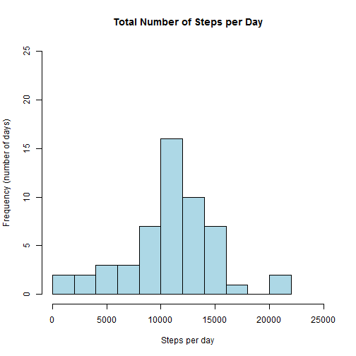
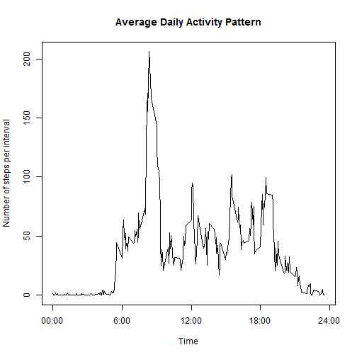
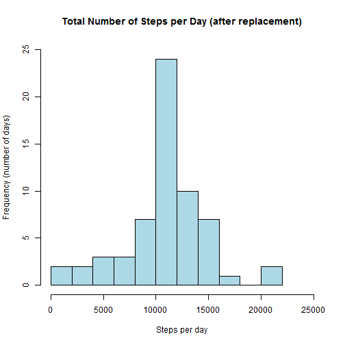
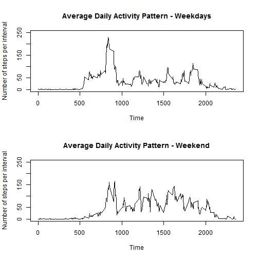

# Reproducible Research: Peer Assessment 1


## Loading and preprocessing the data
Load the dataset which is stored in the csv file "activity.csv".

```r
act <- read.csv("activity.csv")
```


## What is mean total number of steps taken per day?
For that purpose we are using the function "aggregate" which

"Splits the data into subsets, computes summary statistics for each, and returns the result in a convenient form." (R Documentation).

Since we want to compute the total number of steps per day, each subset corresponds to
exactly one day. Therefore, the formula is steps~date. As summary statistic we take the sum,
which gives the total number of steps.

```r
actaggrsum <- aggregate(steps ~ date, data = act, sum)
```

Let's have a look at the histogram which shows a bell-shaped distribution wth heavy tails.

```r
hist(actaggrsum$steps, ylab = "Frequency (number of days)", xlab = "Steps per day", 
    col = "lightblue", main = "Total Number of Steps per Day", breaks = 15, 
    xlim = c(0, 25000), ylim = c(0, 25))
```

 

Mean and median of that distribution are
- mean:

```r
mean(actaggrsum$steps)
```

```
## [1] 10766
```

- median

```r
median(actaggrsum$steps)
```

```
## [1] 10765
```


## What is the average daily activity pattern?
It is useful to have a closer look at the dataset.

```r
str(act)
```

```
## 'data.frame':	17568 obs. of  3 variables:
##  $ steps   : int  NA NA NA NA NA NA NA NA NA NA ...
##  $ date    : Factor w/ 61 levels "2012-10-01","2012-10-02",..: 1 1 1 1 1 1 1 1 1 1 ...
##  $ interval: int  0 5 10 15 20 25 30 35 40 45 ...
```

The column 'interval' contains integers which are multiples of 5 and range between 0 and 2355.
Obviously, these numbers can be interpreted as a time, i.e. 925 corresponds to 09:25:00.
Thus, the average daily activity pattern is obtained performing aggregation by 'interval'
applying the mean function.

```r
actts <- aggregate(steps ~ interval, data = act, FUN = mean)
```

The pattern can be visualized by a simple plot.

```r
plot(actts$steps ~ actts$interval, type = "l", xlab = "Time", ylab = "Number of steps per interval", 
    main = "Average Daily Activity Pattern", xaxt = "n")
axis(1, labels = c("00:00", "6:00", "12:00", "18:00", "24:00"), at = c(0, 600, 
    1200, 1800, 2400))
```

 

The peek value is between 8:00 and 9:00 in the morning (rush hour).
More precisely, it can be located using

```r
which.max(actts$steps)
```

```
## [1] 104
```

```r
actts$interval[which.max(actts$steps)]
```

```
## [1] 835
```

The first result above gives the index of the interval, the second result shows its value.

## Imputing missing values
First we have to take care of the missing values in the dataset.  
Missing values can only occur in the column 'steps'.
Therefore we can compute the **total number of missing values** by

```r
length(act$steps[is.na(act$steps)])
```

```
## [1] 2304
```

Alternatively we can use

```r
summary(complete.cases(act))
```

```
##    Mode   FALSE    TRUE    NA's 
## logical    2304   15264       0
```

which gives the same result.

There are several ways to **replace missing values**.
In the first step we make a copy of the original data frame

```r
actnew <- act
```

As suggested in the assignment description, we could use the mean of the respective 5 min interval.

```r
actnew$steps <- ifelse(is.na(act$steps), actts$steps[match(act$interval, actts$interval)], 
    act$steps)
```

The match function is used to locate act$interval in the data frame actts.
For example when act$interval==645

```r
match(645, actts$interval)
```

```
## [1] 82
```

provides the index for interval 645. Let's check this

```r
actts$interval[match(645, actts$interval)]
```

```
## [1] 645
```


### Impact of inputting missing data
As before, we aggregate to obtain the total number of steps per day.

```r
actnewaggrsum <- aggregate(steps ~ date, data = actnew, sum)
```

The corresponding histogram is given below.

```r
hist(actnewaggrsum$steps, ylab = "Frequency (number of days)", xlab = "Steps per day", 
    col = "lightblue", main = "Total Number of Steps per Day (after replacement)", 
    breaks = 15, xlim = c(0, 25000), ylim = c(0, 25))
```

 

Note that the scale is the same as for the histogram above so that the effect of replacing
missing values becomes more apparent.  
There is a 'peek' at the mean of the distribution.
Mean and median of that distribution are
- mean:

```r
mean(actnewaggrsum$steps)
```

```
## [1] 10766
```

- median

```r
median(actnewaggrsum$steps)
```

```
## [1] 10766
```

The standard deviation decreases when missing values are replaced by means. 

```r
sd(actaggrsum$steps)
```

```
## [1] 4269
```

```r
sd(actnewaggrsum$steps)
```

```
## [1] 3974
```


## Are there differences in activity patterns between weekdays and weekends?
We construct a new column representing the day of the week

```r
actnew$weekday <- factor(weekdays(as.Date(actnew$date)))
```

The levels are

```r
levels(actnew$weekday)
```

```
## [1] "Dienstag"   "Donnerstag" "Freitag"    "Mittwoch"   "Montag"    
## [6] "Samstag"    "Sonntag"
```

The result depends on the language specified in the R settings. 
So we cannot use hard coded strings like 'Sunday' to check if the date is a weekend or not. Therefore, we construct a reference vector with all weekday in the right order.

```r
wdordered <- rep("", times = 7)
wdordered[1] <- weekdays(as.Date("2014-05-12"))
wdordered[2] <- weekdays(as.Date("2014-05-13"))
wdordered[3] <- weekdays(as.Date("2014-05-14"))
wdordered[4] <- weekdays(as.Date("2014-05-15"))
wdordered[5] <- weekdays(as.Date("2014-05-16"))
wdordered[6] <- weekdays(as.Date("2014-05-17"))
wdordered[7] <- weekdays(as.Date("2014-05-18"))
print(wdordered)
```

```
## [1] "Montag"     "Dienstag"   "Mittwoch"   "Donnerstag" "Freitag"   
## [6] "Samstag"    "Sonntag"
```

Now we can introduce a column for the category weekday/weekend.

```r
actnew$wdcat <- ifelse(match(actnew$weekday, wdordered) < 6, "weekday", "weekend")
actnew$wdcat <- factor(actnew$wdcat)
levels(actnew$wdcat)
```

```
## [1] "weekday" "weekend"
```

Next we are building subsets for the two categories

```r
actwd = subset(actnew, wdcat == "weekday")
actwe = subset(actnew, wdcat == "weekend")
```

and corresponding time series with the mean of steps in each 5 min interval.

```r
actwdts <- aggregate(steps ~ interval, data = actwd, FUN = mean)
actwets <- aggregate(steps ~ interval, data = actwe, FUN = mean)
```

Now we can compare the two different time series plots.

```r
par(mfrow = c(2, 1))
plot(actwdts$steps ~ actwdts$interval, type = "l", xlab = "Time", ylab = "Number of steps per interval", 
    main = "Average Daily Activity Pattern - Weekdays", ylim = c(0, 250))
plot(actwets$steps ~ actwets$interval, type = "l", xlab = "Time", ylab = "Number of steps per interval", 
    main = "Average Daily Activity Pattern - Weekend", ylim = c(0, 250))
```

 


